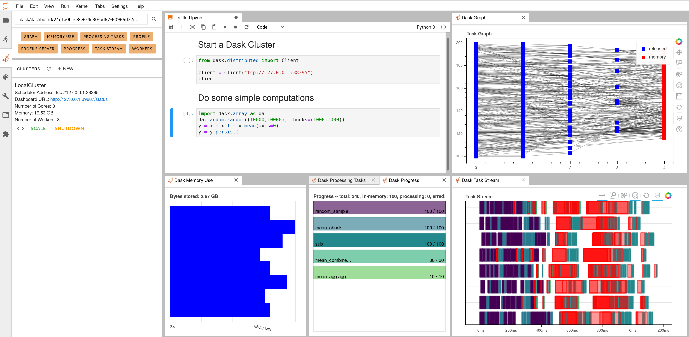

# Dask JupyterLab Extension

This package provides a JupyterLab extension to manage Dask clusters,
as well as embed Dask's dashboard plots directly into JupyterLab panes.



## Requirements

JupyterLab >= 0.35
distributed >= 0.19

## Installation

This extension includes both a client-side JupyterLab extension and a server-side
Jupyter notebook extension. Install these using the command line with

```bash
jupyter labextension install dask-labextension
jupyter serverextension install dask_labextension
```

If you are running Notebook 5.2 or earlier, enable the server extension by running

```bash
jupyter serverextension enable --sys-prefix dask_labextension
```

## Configuration of Dask cluster management

This extension has the ability to launch and manage several kinds of Dask clusters,
including local clusters and kubernetes clusters.
Options for how to launch these clusters are set via the dask configuration system.

### Development install

As described in the [JupyterLab documentation](https://jupyterlab.readthedocs.io/en/stable/developer/extension_dev.html#extension-authoring) for a development install of the labextension you can run the following in this directory:

```bash
jlpm install   # Install npm package dependencies
jlpm run build  # Compile the TypeScript sources to Javascript
jupyter labextension install  # Install the current directory as an extension
```

To rebuild the extension:

```bash
jlpm run build
```

If you run JupyterLab in watch mode (`jupyter lab --watch`) it will automatically pick
up changes to the built extension and rebundle itself.

To run an editable install of the server extension, run

```bash
pip install -e .
jupyter serverextension enable --sys-prefix dask_labextension
```
